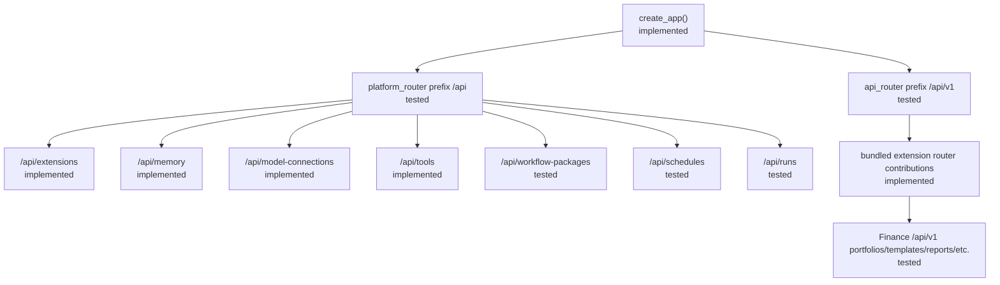
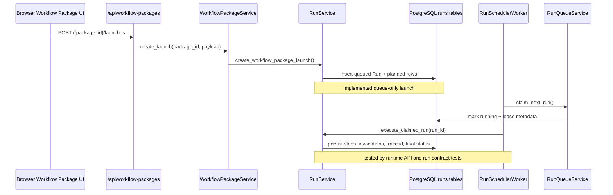
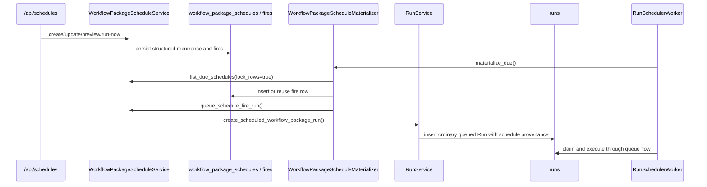
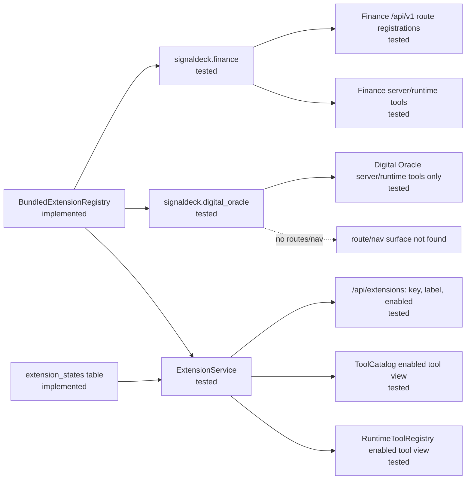
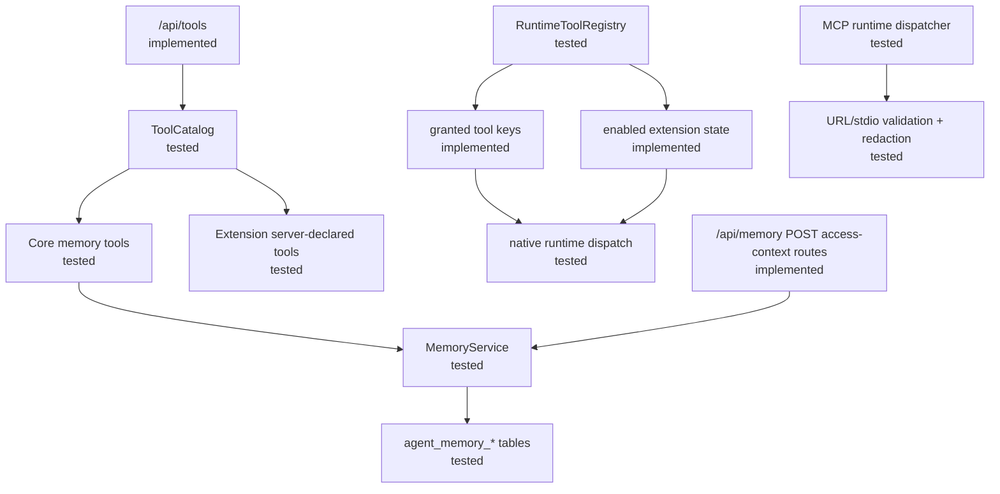
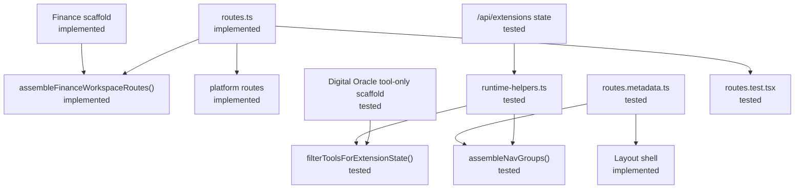
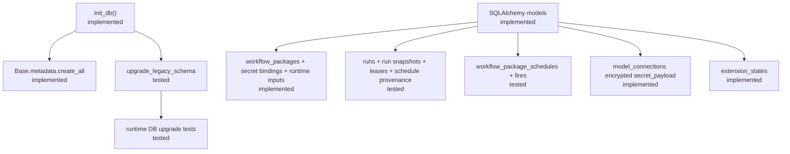
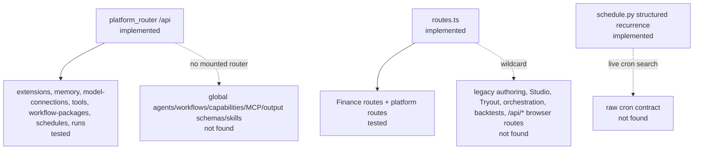

# Current Architecture Diagrams

These diagrams describe the current implemented architecture only. They do not propose target architecture or remediation.

## Diagram Legend

- `implemented`: live route, service, model, schema, worker, or frontend wiring evidence exists.
- `tested`: implementation evidence plus named automated test evidence exists.
- `documented only`: repo documentation evidence exists, but this pass did not confirm live implementation.
- `not found`: baseline/checklist expectation was searched for but not found in inspected live code.

## Backend Router Composition

Evidence notes: `backend/app/main.py:41`, `backend/app/main.py:90`, `backend/app/api/platform_router.py:12`, `backend/app/api/router.py:5`, `backend/app/extensions/signaldeck_finance/api_routers.py:34`, `backend/tests/test_legacy_backend_cutover.py:62`.

## Workflow Package Launch And Run Execution

Evidence notes: `backend/app/api/workflow_packages.py:313`, `backend/app/services/workflow_package_service.py:283`, `backend/app/services/run_service.py:397`, `backend/app/services/run_queue_service.py:80`, `backend/app/workers/run_scheduler.py:183`, `backend/tests/test_workflow_package_runtime_api.py:956`.

## Scheduled Task Materialization

Evidence notes: `backend/app/api/schedules.py:23`, `backend/app/schemas/schedule.py:49`, `backend/app/services/workflow_package_schedule_materializer.py:82`, `backend/app/services/workflow_package_schedule_service.py:454`, `backend/app/workers/run_scheduler.py:107`, `backend/tests/test_runtime_repositories.py:1748`.

## Extension Gating And Ownership

Evidence notes: `backend/app/extensions/registry.py:279`, `backend/app/services/extension_service.py:94`, `backend/app/services/extension_service.py:97`, `backend/app/services/extension_service.py:165`, `backend/app/extensions/signaldeck_finance/api_routers.py:34`, `frontend/src/extensions/signaldeck-digital-oracle/scaffold.ts:21`, `backend/tests/test_extensions_api.py:50`, `backend/tests/test_tool_catalog_api.py:399`.

## Tools, MCP, And Memory Boundary

Evidence notes: `backend/app/api/tools.py:14`, `backend/app/agents/tool_catalog/server_declared.py:7`, `backend/app/agents/runtime_tools/registry.py:84`, `backend/app/agents/mcp/runtime.py:111`, `backend/app/agents/mcp/security.py:44`, `backend/app/api/memory.py:22`, `backend/tests/test_runtime_tools.py:3377`, `backend/tests/test_memory_service.py:646`.

## Frontend Route And Navigation Assembly

Evidence notes: `frontend/src/routes.ts:29`, `frontend/src/routes.ts:30`, `frontend/src/extensions/runtime-helpers.ts:110`, `frontend/src/extensions/runtime-helpers.ts:173`, `frontend/src/extensions/signaldeck-digital-oracle/scaffold.ts:21`, `frontend/src/routes.metadata.ts:65`, `frontend/src/routes.test.tsx:177`.

## Persistence And Schema Authority

Evidence notes: `backend/app/db/session.py:16`, `backend/app/db/session.py:23`, `backend/app/db/session.py:31`, `backend/app/models/workflow_package.py:16`, `backend/app/models/run.py:15`, `backend/app/models/workflow_package_schedule.py:15`, `backend/app/models/model_connection.py:159`, `backend/tests/test_runtime_db_upgrades.py:2288`.

## Removed Or Not Found Surfaces

Evidence notes: `backend/app/api/platform_router.py:4`, `backend/app/api/platform_router.py:12`, `backend/tests/test_legacy_backend_cutover.py:46`, `frontend/src/routes.ts:51`, `frontend/src/routes.test.tsx:459`, `frontend/src/routes.test.tsx:510`, `backend/app/schemas/schedule.py:49`, live-code search for `cron|crontab|Cron`.

## Status-Labeled Diagram Notes

- `tested`: Router, launch queue, schedule materialization, extension gating, frontend routing, and CI-backed coverage are represented with automated-test anchors.
- `implemented`: Low-level persistence and schema authority diagrams use model/service/schema evidence even when the diagram node itself is not a single test assertion.
- `documented only`: This diagrams file itself is part of the documentation-only audit workspace.
- `not found`: Raw cron, Digital Oracle frontend route/nav, and removed global authoring route surfaces were not found in the inspected live router composition.
